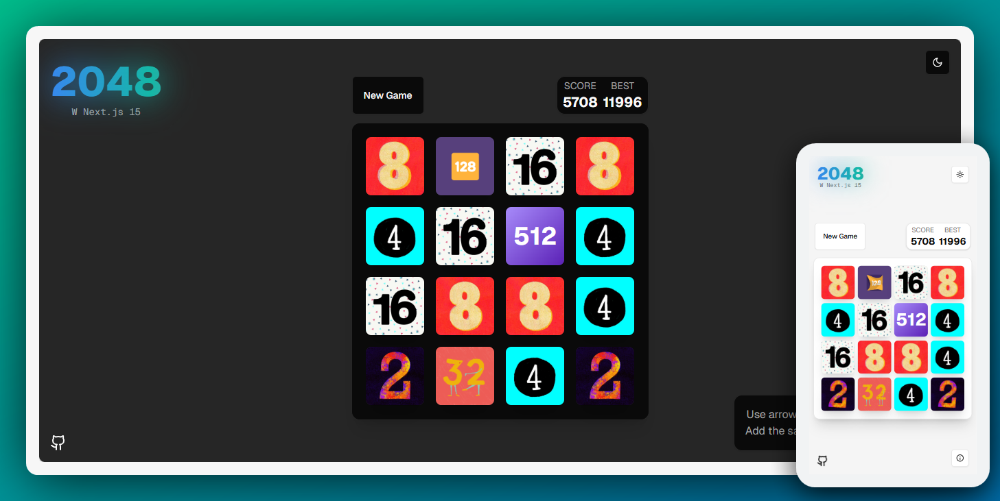

# 2048 Game in Next.js 15



## Description

Experience the classic 2048 game reimagined with the latest web technologies. Built with Next.js 15 and modern components, this project offers a seamless and responsive gaming experience, leveraging the power of Tailwind CSS and other cutting-edge tools.

## Features

- **Responsive Design**: Enjoy the game on any device, whether it's a desktop, tablet, or mobile.
- **Modern Components**: Built with Shadcn for a smooth and interactive experience.
- **Dark Mode**: Automatically adapts to your system's theme settings.

## Tech Stack

- **Next.js**: 15.1
- **Tailwind CSS**: 3.4
- **TypeScript**
- **Framer Motion**: 11.1
- **Lucide React**: 0.46
- **Vercel**: For deployment

## Installation

To get started, clone the repository and install the dependencies:

```bash
git clone https://github.com/bekione/nextjs-2048-tiles.git
cd nextjs-2048-tiles
npm install
```

## Collaboration Guide

We welcome contributions from the community! To get started with contributing, follow these steps:

1. **Fork the Repository**: Click the "Fork" button at the top right of the repository page.
2. **Clone Your Fork**: Clone your forked repository to your local machine.

```bash
git clone https://github.com/bekione/nextjs-2048-tiles.git
cd nextjs-2048-tiles
```
3. **Create a Branch**: Create a new branch for your feature or bug fix.
```bash
git checkout -b feature-name
```
4. **Make Changes**: Make your changes to the codebase.
5. **Commit Changes**: Commit your changes with a descriptive commit message.

```bash
git commit -m "Add feature-name"
```
7. **Create a Pull Request**: Open a pull request to the main repository, describing your changes and the problem they solve.

Thank you for contributing!

## Credit

Inspired by Animated 2048 games online and wrote the game myself.

